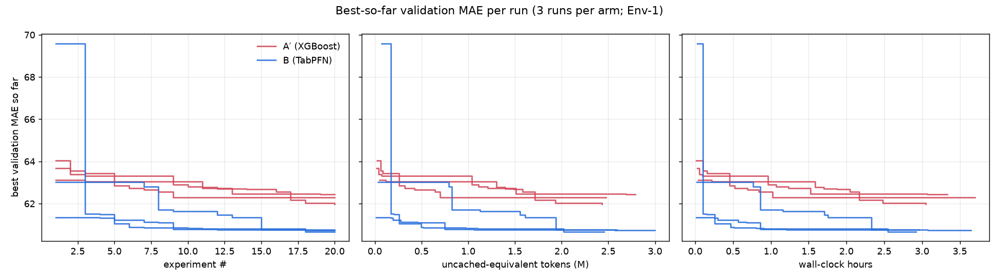

# What does a cheap predictive hypothesis do to an autonomous data scientist?

**Prior Labs TabPFN-3.5 Hackathon entry.** We give the same LLM researcher the same data, task, prompt and
budget, and change one thing — the model behind its `experiment()` tool: **TabPFN-3.5** (Arm B) or a fixed,
untuned **XGBoost** (Arm A′). Then we measure what it finds, what it costs, and where its effort goes.

> **Working thesis.** TabPFN reduces the cost of autonomous predictive experimentation by collapsing
> preprocessing, model selection and tuning into a reusable prediction primitive.

## Results at a glance (Env-1: 3 runs per arm, 20 experiments each)

| | **B — TabPFN-3.5** | **A′ — XGBoost** |
|---|---:|---:|
| Best validation MAE (mean ± sd over runs) | **60.72 ± 0.04** | 62.24 ± 0.24 |
| Paired, household-clustered bootstrap, B − A′ | **−1.52** MAE, 95% CI [−2.19, −1.02] | |
| Experiments to reach A′'s mean final MAE (62.24), per run | **3, 8, 1** | 17 (1 of 3 runs; 2 never) |
| **Frozen test MAE** (fit train+val), mean ± sd | **64.09 ± 0.12** | 65.03 ± 0.18 |
| Paired bootstrap on test, B − A′ | **−0.94** MAE, 95% CI [−1.28, −0.61] | |
| Valid experiments / 60 | 52 | 58 |
| Valid hypotheses per hour / per M tokens | 5.50 / 6.49 | **5.80 / 7.58** |
| Effort on model engineering + debugging (share of tool calls) | 58% | 51% |
| LLM cost per run | ≈ $0.37 | ≈ $0.35 |

What the evidence supports:

1. **TabPFN makes the researcher better, fast — and it holds on the frozen test.** Every B run beats every A′
   run on validation, and B reaches the level A′ ends at within a median of 3 experiments (minutes), a level
   two of three A′ runs never reach. On the held-out test period the gap shrinks from 1.52 to **0.94 MAE**
   (selection on validation is optimistic) but stays clear: all 9 run pairings favour B.
2. **Mostly a better fit, partly better features.** The representation-transfer check (each run's best
   feature table on the other backend) puts roughly **¾ of B's edge on the model** — TabPFN fits A′'s own
   tables 1.13 MAE better than XGBoost does — and **¼ on the features B found** (0.39 MAE on a common backend).
3. **TabPFN did *not* make individual hypotheses cheaper, and did *not* move effort away from plumbing.**
   Per experiment, both arms cost the same tokens and time; B tests slightly *fewer* valid hypotheses per
   hour and per token. Agents in *both* fixed-model arms rebuilt the plumbing they were spared: **41% of all
   code they ran fitted their own models** (numpy ridge, least squares, two hand-written gradient-boosting
   implementations) to pre-screen features against train labels.

The headline finding is therefore narrower and, we think, more interesting than the thesis: *a strong
reusable primitive raises the quality ceiling and the speed to a good answer, but an autonomous agent with a
score to minimise will re-create model engineering around any fixed primitive.*



### Frozen test (Phase 12)

Each run's final candidate was chosen on validation only and evaluated once on the 5 test snapshots
(12,490 rows). Test features did not exist during research, so `scripts/evaluate_test.py` replays every
code cell that saved a table up to the final experiment, with a harness-only switch that makes
`build_features` also emit test-snapshot rows (still as-of per snapshot), and checks that the replayed
train+validation rows reproduce the logged feature table before scoring. The agents' `assert` statements
(research-time row counts) are stripped; they compute nothing.

| Run | Final | Val MAE | Test MAE (fit train+val) | Test MAE (fit train) | Reproduction |
|---|---|---:|---:|---:|---|
| B/0 | E018 | 60.67 | 64.14 | 63.74 | exact |
| B/1 | E015 | 60.76 | 64.18 | 64.18 | exact |
| B/2 | E019 | 60.73 | 63.95 | 63.78 | approximate¹ |
| A′/0 | E019 | 62.45 | 65.22 | 65.70 | exact |
| A′/1 | E020 | 61.98 | 64.86 | 65.12 | exact |
| A′/2 | E009 | 62.29 | 65.00 | 65.04 | approximate¹ |

¹ Same rows and columns; values differ only through statistics the agent computed over the whole table,
which in the replay includes test-period **feature** values (never labels): B/2's hinge knots are feature
quantiles (29 columns, max relative difference 0.068); A′/2 submitted a row-number column `index` left over
from `reset_index()`. Restricted to the four exact reproductions the means are B 64.16 vs A′ 65.04.

- Validation→test degradation (same train-only fit) is similar in both arms: +3.18 (B) vs +3.05 (A′).
- Adding the validation rows to training helps XGBoost (65.29 → 65.03) but not TabPFN (63.90 → 64.09), so
  B's edge narrows from 1.39 to 0.94 as training data grows — consistent with TabPFN's advantage being
  largest in the small-data regime. One data point; we do not generalise it.

---

## Design

```text
                 ┌──────────── identical in every arm ────────────┐
 LLM researcher ─┤ objective prompt · budget · as-of data API      ├─► experiment(table) ─► fixed evaluator
 (GLM 5.3 Flash) │ inspect · run_python (pandas/numpy only)        │        backend: TabPFN-3.5 (B)
                 └─────────────────────────────────────────────────┘                 XGBoost   (A′)
```

- **Task.** dunnhumby *The Complete Journey*: ~2,500 households, 711 days. Predict
  `future_spend_4w` = a household's spend in the 28 days after a snapshot day. 22 snapshots every 28 days;
  temporal split by snapshot (13 train / 4 validation / 5 test); zero-spend windows kept (~20% of rows).
  Metric: **MAE**; point prediction is loss-consistent in both arms (TabPFN median; XGBoost L1 objective).
- **Arms differ only in the backend.** A′ and B receive byte-identical prompts and tool descriptions; the
  backend is never named. XGBoost is fixed and untuned (`reg:absoluteerror`, 500 trees, lr 0.05, depth 6, no
  early stopping); TabPFN-3.5 is used with defaults through the Prior Labs API. Neither is tuned — the
  transfer check is what answers "XGBoost was handicapped".
- **Budget.** 20 experiments per run; at most 15 other tool calls between experiments (exceeding it fails
  the experiment); invalid `experiment()` calls also consume budget. Context resets every experiment: the
  agent sees a compact history table, never earlier code.
- **E000** (demographics + snapshot calendar only) is the common root: MAE 92.5 on both backends.
- **No agent framework.** A ~200-line hand-written loop (`src/researcher/agent.py`) on an OpenAI-compatible
  client pointed at OpenRouter, so no injected prompts or retry logic become protocol variables.

### Leakage control (by construction, then audited)

- **As-of accessor.** All data access goes through `agent_api`. `build_features(fn)` calls `fn(view, day)`
  per snapshot with every table filtered to what was knowable that day, each call in a **forked child**
  process so state cannot flow between snapshots. Direct views (`snapshot`, `history`, `inspect`) are capped
  at day 459, the first validation snapshot. `train_targets()` returns **train labels only**.
- **Static enforcement plus audit, not a sandbox.** `run_python` checks code before running it: an AST
  import allowlist (pandas, numpy, stdlib basics), blocked file I/O, reflection and private API access, and
  a string-pattern tripwire; the subprocess gets a stripped environment and scrubbed output. Every executed
  cell is re-audited after the run (`make audit`: clean).
- **Evaluator owns everything else**: keys, target, split, encoding, backend config, metric, logging.

### The side channel we found — and closed

At validation snapshot 543 the as-of view legitimately contains the label windows of validation snapshots
459/487/515. Only `fn`'s returned DataFrame is meant to leave the child process, but two other routes
existed in the MVP environment: anything `fn` **printed**, and **exception messages** raised inside `fn`.
Our post-run audit (`docs/audit_label_access.md`) found that **neither was used**: prints inside `fn` never
reached the agent at all (the child exited without flushing stdout — which also silently hid the agents'
own debug output, equally in both arms), and all 33 `fn` failures happened at a train snapshot, before any
validation snapshot ran. That is a closed route by accident and ordering, not by design. It is now closed
**by design, with tests**: inside `fn`, output is visible at train snapshots and suppressed at validation
snapshots, and validation-snapshot errors are reduced to type and line. Runs after this fix form a separate
environment (Env-2) and are never mixed with the results above.

## Behaviour findings

- **Agents rebuilt model engineering around a fixed model.** 380 of 923 executed cells (41%) fit the
  agent's own model on train labels — ridge/least-squares sweeps, and in two B runs a gradient-boosting
  implementation written from scratch in numpy (allowlist: no sklearn) — almost always scored on a temporal
  pseudo-holdout inside train (fit ≤ snapshot 375/403, score 403/431). 607/923 (66%) touched labels at all.
  One such local proxy had a rank correlation of −0.10 with the real validation score.
- **Four agents reached for labels they were not given.** Four cells filtered `train_targets()` for
  validation snapshot days. They received zero rows (MAE `nan`). This most likely reflects a wrong
  assumption that the function covers every split rather than intent, but the behaviour is real: an agent
  with a budget and a score to minimise went looking for validation labels, and we only know the
  protection held because we checked.
- **One agent mapped its sandbox on purpose**, writing a probe that calls each API function from inside a
  snapshot and reports what is allowed. It found nothing beyond train labels.
- **Stacking without care.** One submitted feature (`gbm_pred`, B seed 2 E017) was fitted on train labels
  and predicted back onto the same train rows; not a validation leak, not a best table, and it scored worse
  than the run's best — the agent noticed, but its out-of-fold rewrite was never saved.
- **Failures.** B: 8 failed experiments, of which 3 came from one run reusing a run-directory path leaked in
  tracebacks (a harness bug, since fixed) and 5 were agent errors; A′: 2 agent errors. 5 vs 2 is too few to
  call an arm difference.

## Reproduce

```bash
# 1. setup
uv sync                                    # Python 3.12; exact pins in pyproject.toml / uv.lock
cp .env.example .env                       # TABPFN_API_KEY (Prior Labs), OPENROUTER_API_KEY
# 2. data — see data/README.md (download from dunnhumby; md5-checked)
make data check targets                    # typed parquet, schema checks, target table
# 3. harness
make test                                  # 58 tests: leakage, sandbox, evaluator contract, agent loop
make baseline manual                       # E000 and E001–E003 on both backends
uv run python scripts/smoke_test_tabpfn.py --backend api   # API smoke test + row-budget timing
# 4. research runs (≈3 h each; run in parallel)
make run ARM=b SEED=0 BUDGET=20            # also ARM=a_prime; SEED=0,1,2
make audit
# 5. analysis
uv run python -m src.analysis.compare_runs # trajectories, bootstrap, time-to-quality, summary.csv
uv run python -m src.analysis.transfer     # representation transfer
uv run python -m src.analysis.effort       # action-based effort shares
uv run python scripts/audit_labels.py      # label-access audit
uv run python scripts/evaluate_test.py --accept-approx   # Phase 12: replay each final table, score test once
uv run python -m src.analysis.frozen_test  # test summary + paired bootstrap
```

`tabpfn.backend: local` in `config/default.yaml` runs TabPFN on a local GPU instead of the API.

## Compute and versions

- TabPFN-3.5 via the Prior Labs API (`tabpfn-client` 0.6.1, model `v3.5_default`, checkpoint
  `tabpfn-v3.5-20260909`); 35k × 30 fit+predict in ~17 s. Every experiment log records the seed, the package
  versions and the checkpoint. Small differences across CPU/GPU/MPS are expected even with a fixed seed.
- XGBoost 3.4.1 locally (`hist`). LLM: `z-ai/glm-5.3-flash` via OpenRouter, temperature 0.7, no reasoning
  cap; it is the one non-seeded component, hence several runs per arm. Provider routing varied per call and
  is logged.
- Totals for the six MVP runs: ~16M tokens, ≈ $2.2 LLM cost, ≈ 0.9M TabPFN credits.

## Limitations

- **Three runs per arm, one dataset, one LLM.** The bootstrap CI reflects row sampling, not run-to-run LLM
  variance; with three runs per arm that variance is only roughly characterised (sd 0.04 vs 0.24).
- **Best-of-20 on validation is optimistic** (B's edge 1.52 on validation, 0.94 on test); the frozen test
  is the honest number. Two of six test numbers come from approximate replays (see the Phase 12 table).
- **Effort classification is rule-based on actions** (code patterns, retries), checked by hand on a sample;
  its "preprocessing" class is unreliable (≈3% of calls).
- **Arm A (free-form researcher with sklearn/XGBoost and its own model choice) was not run.** It would
  measure what the harness itself is worth (A vs A′). It requires a rerun of all arms under the fixed
  environment (Env-2) and is listed as future work.
- Not run: tree/best-first search over experiments; a second dataset.

## What we do not claim

TabPFN does not eliminate data science; it does not always beat XGBoost; feature engineering is not
unnecessary; autonomous research is not solved.

## Repository

```text
src/data/        schema registry, loaders, targets, splits, as-of accessor
src/evaluation/  evaluator, backends, metrics, experiment log
src/researcher/  agent loop, agent_api, prompts, arms, trace logging
src/tools/       run_python (static enforcement), inspect, experiment, audit
src/analysis/    compare_runs, transfer, effort
scripts/         convert_raw, check_schema, build_targets, run_baseline, run_manual,
                 run_researcher, evaluate_test, audit_labels, smoke_test_tabpfn
docs/            data_schema.md, audit_label_access.md, figures/
experiments/     results/<arm>/<seed>/ (logs, code, transcripts), analysis/
```

## Attribution

Data: **dunnhumby — The Complete Journey** (© dunnhumby; not redistributed; see `data/README.md`).
Model: **TabPFN-3.5** by **Prior Labs**. Built for the Prior Labs TabPFN-3.5 Hackathon.
