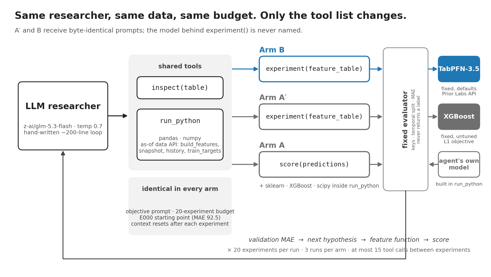
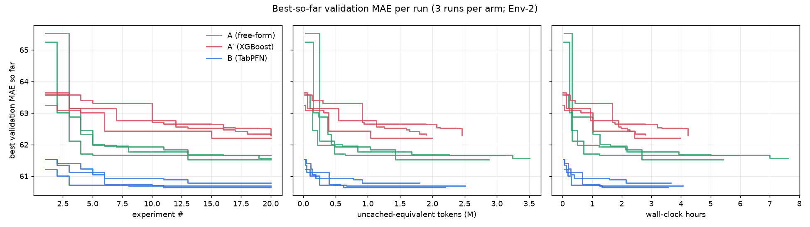
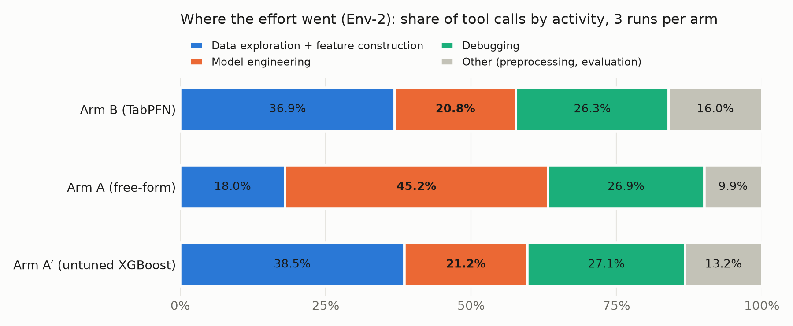

# TabPFN for autonomous research

I gave an AI researcher a fixed prediction primitive (`experiment()`) changing only what's behind it. With **TabPFN 3.5** it reached lower error than a researcher free to build its own models in the first experiments, minutes in. The primitive moved the researcher's effort towards data explorations, although, it did not remove modelling efforts completely. 

<p align="center">
  
</p>

## Why I built this

I wanted to test if giving an AI agent the `experiment()` primitive would improve an autonomous researcher. It is a very primitive [agent](agent_design.md) on purpose because I needed to see every call made by the model without a harness (complex or minimal) confounding the results. 

What TabPFN has built is extremely exciting, it allows us to move from working on mere data preparation to actually discovering predictive features. That's why I believe this will enable LLMs to spend less tokens getting data ready for prediction (provided that all other statistical constraints are respected, see [below](#future-work)).

## What I tested

**Prediction Task:** Using two years of grocery data (transactions, coupons, campaigns, etc.) predict how much a household will spend in the *next four weeks*. 

I gave the same agent the same data, task, prompt and budget, and change only its tool list:
| Arm | Who does the modelling | Scoring tool |
|---|---|---|
| **B** | a fixed **TabPFN-3.5** model the agent cannot see or change | `experiment(feature table)` |
| **A′** | a fixed, untuned **XGBoost** model | `experiment(feature table)` |
| **A** | **the agent itself**: it picks, builds and trains its own models (sklearn, XGBoost, scipy) | `score(its own predictions)` |

> **Working thesis.** TabPFN reduces the cost of autonomous predictive experimentation by collapsing
> preprocessing, model selection and tuning into a reusable prediction primitive.

## Results

**Train-only**: Test MAE is fit on train only, the regime all three arms can be scored in. 

| 3 runs per arm | **Arm B (TabPFN)** | **Arm A (free-form)** | **Arm A′ (untuned XGBoost)** |
|---|---:|---:|---:|
| Best validation MAE (mean ± sd) | **60.71 ± 0.08** | 61.58 ± 0.07 | 62.27 ± 0.06 |
| Held-out test MAE (train-only fit) | **63.79** (3 runs) | 64.65 (2 runs) | 65.69 (2 runs)* |
| First reaches A's final level (61.58) | **experiment 1, after 1–5 min** | 2.7 h, 7.0 h, never | never |
| Hours per run | 3.8 | **6.3** | 3.7 |
| Share of effort on model engineering | 21% | **45%** | 21% |



*Only 2 runs because A/1 and A'/0 did not reproduce correctly. 

### Where the effort went

Every tool call is labelled from what the agent *did* (its code and actions, never its reasoning text).

| | Arm B (TabPFN) | Arm A (free-form) | Arm A′ (untuned XGBoost) |
|---|---:|---:|---:|
| **Model engineering** | 20.8% | **45.2%** | 21.2% |
| Debugging | 26.3% | 26.9% | 27.1% |
| Data exploration + feature construction | 36.9% | **18.0%** | 38.5% |
| Code cells that fit any model | 31.6% | **56.8%** | 32.1% |



### Transfer Table (from Env-1)

Does TabPFN find better features, or fit the same features better? 

Each run's best feature table was re-scored on the other backend (Env-1, validation, mean over seed pairs):

| Model   | A′'s features | B's features |
|---------|--------------:|-------------:|
| XGBoost |         62.24 |        64.33 |
| TabPFN  |         61.11 |        60.72 |

TabPFN scores lower on every table. But B's features hurt XGBoost (+2.09) while helping TabPFN only slightly (−0.39): each agent's representations are specific to the backend that scored them, and the feature×backend interaction is larger than the whole gap, so the gap cannot be split into "model" and "features". Env-2 replicates the direction on 4 of 6 tables; the two exceptions carry a leftover row-number index column, and re-fitting without it restores TabPFN's lead (60.92, 60.78 vs 62.32, 62.20).

### Hypothesis Costs

| per run, Env-2                               | Arm A (free-form) | Arm A′ (untuned XGBoost) | Arm B (TabPFN) |
|----------------------------------------------|--------------:|-------------:|-----------:|
| Valid experiments (of 20)                    |          17.0 |         17.3 |       17.0 |
| Hours                                        |          6.33 |         3.67 |       3.76 |
| Valid experiments per hour                   |          2.73 |         4.87 |       4.53 |
| Uncached LLM tokens per valid experiment     |          186k |         122k |       127k |
| Tool calls per experiment                    |          12.4 |          8.5 |        8.4 |
| run_python errors                            |            61 |           41 |         41 |
| Median evaluator time (s)                    |          0.03 |          4.0 |       21.7 |
| LLM cost (USD)                               |          0.31 |         0.28 |       0.25 |

## Takeaways

- **Arm B wins (TabPFN).** Beats arm A on eror and on time to a good answer.  
- **More time, more accuracy, less LLM cost** At less expense from LLM calls, more time (due to TabPFN's calls) Arm B achieved the best MAE. 
- **A primitive is only as good as its backend** The **exact** same harness with an untuned XGBoost (arm A') is the worst of three. **Even the free form agent beats it**.
- **The `experiment()` tool DOES move work toward the data but did not remove it** Arm A spent 45% of its effort on modeling, twice as much as arm B. But *I believe this can be overcome with a better harness*. 

### What held

- Given that the AI agent had an `experiment()` primitive did it redirect its efforts to find predictive features?
  - It **did spend less time on modeling**. See Arm A vs Arm B (45% -> 21%)
  - It still does some modeling work (21%). If this is done, a robust tool like TabPFN needs to be used. 
  - It **did redirect its effort towards exploration and building features**: 18% -> 38%.

### What did not

- Hypothesis: The 20 calls per experiment made using `experiment()` an expensive feature so the AI agent built its own. 

See [Future Work](#future-work)

---

## Deep Dive on an Experiment

### Arm B: hypothesis to score in about a minute

**Run B/0, experiment 1.** Starting point: E000, customer demographics and calendar only: MAE 92.53.

> **Hypothesis:** *"A household's recent purchasing behaviour (spend in trailing windows, trip frequency, recency,
> trend) predicts its next-4-week spend; …"*

| Step | What the agent did | Time |
|---|---|---:|
| 1 | `run_python`: print the table descriptions and snapshot dates; first attempt errors | 12 s |
| 2 | `run_python`: look at one snapshot's transactions and a household's history | 7 s |
| 3 | `run_python`: read the training answers: mean, median, share of zero-spend households | 7 s |
| 4 | `run_python`: write the feature function, build the table, save it | 21 s |
| 5 | `experiment`: TabPFN trains and scores | 20 s |

**Result: MAE 61.53**, a third better than the baseline, in **5 tool calls and about a minute**. The feature function
is ordinary pandas, the hypothesis translated directly into columns (abridged from `E001/code.py`):

```python
def make_feats(view, sd):                       # one snapshot date at a time; nothing after sd is visible
    tx = view.table("transactions")
    out = pd.DataFrame(index=view.households)
    for w in [28, 56, 84, 112, 364]:            # "spend in trailing windows"
        out[f"spend_{w}"] = tx[tx.day > sd - w].groupby("household_key").sales_value.sum()
    out["trips_28"] = ...                       # "trip frequency"
    out["days_since_last"] = ...                # "recency"
    out["trend"] = ...                          # "last 28 days vs the 28 before"
    return out

ft = build_features(make_feats)                 # the harness runs it per snapshot, past data only
path = save_table(ft, "e001_history")         # then the agent calls the experiment tool with this path,
                                                 # its hypothesis, and parent E000
```

### Arm A: the same idea, plus building the model

**Run A/0, experiment 13** (its best). By now the features were settled; the hypothesis was about the *model*:

> **Hypothesis (paraphrased):** averaging a diverse ensemble of XGBoost median-regression models trained on the raw
> target with one trained on the residual (target minus a persistence baseline) improves accuracy.

It took **14 tool calls and 20 minutes**. The first LLM call alone spent 4.5 minutes and 11,900 tokens planning.
Then came 13 `run_python` cells: training models (30–130 seconds each), checking them on a held-out slice of the
training period (fit on dates up to 403, check on 431), and fixing three errors. Finally `score`: **MAE 61.52**. B's first experiment had reached the same
level in about a minute.

That contrast is the whole study in miniature: **with a strong fixed model, a hypothesis about the data is one
feature function away from a score. Without one, every idea also needs a model built, tuned and debugged.**

## Reading the results

`experiments/results_env2/<arm>/<seed>/` holds one run (arms `b`, `a_prime`, `a`; seeds 0–2):

- `experiments.jsonl`: **start here**. One line per experiment: hypothesis, parent, MAE, status, time, tokens.
- `E0xx/code.py`: the code the agent ran for that experiment.
- `transcript.jsonl`: the full session, message by message.
- `system_prompt.txt`, `tools.json`: exactly what the agent was told.

Summary tables are in `experiments/analysis_env2/`.


---

## Design

```text
                 ┌──────────── identical in every arm ────────────────┐
 LLM researcher ─┤ objective prompt · budget · as-of data API · E000   │
 (GLM 5.3 Flash) │ inspect · run_python                                │
                 └───────────────┬────────────────────┬───────────────┘
                                 │                    │
            A′ / B: run_python (pandas, numpy)   A: run_python (+ sklearn, XGBoost, scipy)
                    experiment(feature table)       score(own validation predictions)
                                 │                    │
                          fixed evaluator ◄───────────┘
                     backend: TabPFN-3.5 (B)     metric, split, keys owned
                              XGBoost   (A′)     by the evaluator in all arms
```

- **Task.** dunnhumby *The Complete Journey*: ~2,500 households, 711 days. Predict
  `future_spend_4w` = a household's spend in the 28 days after a snapshot day. 22 snapshots every 28 days;
  temporal split by snapshot (13 train / 4 validation / 5 test); zero-spend windows kept (~20% of rows).
  Metric: MAE. The point prediction is loss-consistent in the harnessed arms (TabPFN median; XGBoost L1 objective); Arm A chooses its own.
- **Arms differ only in the tool list.** A′ and B receive byte-identical prompts and tool descriptions; the
  backend is never named. XGBoost is fixed and untuned (`reg:absoluteerror`, 500 trees, lr 0.05, depth 6, no
  early stopping); TabPFN-3.5 is used with defaults through the Prior Labs API. Neither is tuned — the
  transfer check is what answers "XGBoost was handicapped".
  
  Arm A replaces experiment() with score(), which checks that the submitted keys match the validation split exactly, computes the metric, logs, and never returns a label; its run_python allowlist adds sklearn, XGBoost and scipy. Prompt and budget are otherwise identical.
- **Budget.** 20 experiments per run; at most 15 other tool calls between experiments (exceeding it fails
  the experiment); invalid `experiment()` or `score()` calls also consume budget. Context resets every experiment: the
  agent sees a compact history table, never earlier code.
- **E000** (demographics + snapshot calendar only) is the common root: MAE 92.5 on both backends.
- **No agent framework.** A ~200-line hand-written loop (`src/researcher/agent.py`) on an OpenAI-compatible
  client pointed at OpenRouter, so no injected prompts or retry logic become protocol variables.

### Leakage control (by construction, then audited)

- **As-of accessor.** All data access goes through `agent_api`. `build_features(fn)` calls `fn(view, day)`
  per snapshot with every table filtered to what was knowable that day, each call in a **forked child**
  process so state cannot flow between snapshots. Direct views (`snapshot`, `history`, `inspect`) are capped
  at day 459, the first validation snapshot. `train_targets()` returns **train labels only**.
- **Static enforcement plus audit, not a sandbox.** `run_python` checks code before running it: an AST
  import allowlist (pandas, numpy, stdlib basics), blocked file I/O, reflection and private API access, and
  a string-pattern tripwire; the subprocess gets a stripped environment and scrubbed output. Every executed
  cell is re-audited after the run (`make audit`: clean).
- **Evaluator owns everything else**: keys, target, split, encoding, backend config, metric, logging.

### Side channel found and closed after runs (no impact)

At validation snapshot 543 the as-of view legitimately contains the label windows of validation snapshots
459/487/515. Only `fn`'s returned DataFrame is meant to leave the child process, but two other routes
existed in the MVP environment: anything `fn` **printed**, and **exception messages** raised inside `fn`.
Our post-run audit (`docs/audit_label_access.md`) found that **neither was used**: prints inside `fn` never
reached the agent at all (the child exited without flushing stdout — which also silently hid the agents'
own debug output, equally in both arms), and all 33 `fn` failures happened at a train snapshot, before any
validation snapshot ran. That is a closed route by accident and ordering, not by design. It is now closed
**by design, with tests**: inside `fn`, output is visible at train snapshots and suppressed at validation
snapshots, and validation-snapshot errors are reduced to type and line. Runs after this fix form a separate
environment (Env-2) and are never mixed with the results below (Env-1 Appendix).

**A second route, found after both environments had run.** `snapshot()` and `history()` refuse any day after the
research horizon (459), but the view class they wrap, `AsOf`, was also exported to agent code, and the class itself
had no cap: `AsOf(683)` would have returned data covering the validation and test label windows. The prompt never
mentioned it. An audit of all 2,650 code cells executed in both environments (smoke runs included) found **no
cell that calls or even names `AsOf`**, so no reported number is affected. It is now closed **by design, with
tests**: the cap lives in the view class (set only inside the agent's process; inside each `build_features`
snapshot, views are limited to that snapshot's own day), `AsOf` is no longer a public name, and every route found (direct, imported, `type(view)(day)`, changing the limit) is refused. This change postdates both
environments' runs. Replaying Env-1 B/0 and Env-2 A/0 under the fixed code
reproduced their committed results exactly (no cell changed outcome).

## Behaviour findings 

- **Agents rebuilt model engineering around a fixed model.** 380 of 923 executed cells (41%) fit the
  agent's own model on train labels — ridge/least-squares sweeps, and in two B runs a gradient-boosting
  implementation written from scratch in numpy (allowlist: no sklearn) — almost always scored on a temporal
  pseudo-holdout inside train (fit ≤ snapshot 375/403, score 403/431). 607/923 (66%) touched labels at all.
  One such local proxy had a rank correlation of −0.10 with the real validation score.
- **Four agents reached for labels they were not given.** Four cells filtered `train_targets()` for
  validation snapshot days. They received zero rows (MAE `nan`). This most likely reflects a wrong
  assumption that the function covers every split rather than intent, but the behaviour is real: an agent
  with a budget and a score to minimise went looking for validation labels, the protection held because it was checked. 
- **One agent mapped its sandbox on purpose**, writing a probe that calls each API function from inside a
  snapshot and reports what is allowed. It found nothing beyond train labels.
- **Stacking without care.** One submitted feature (`gbm_pred`, B seed 2 E017) was fitted on train labels
  and predicted back onto the same train rows; not a validation leak, not a best table, and it scored worse
  than the run's best — the agent noticed, but its out-of-fold rewrite was never saved.

## Future Work

### Less expensive primitive
I gave each arm 20 calls of `experiment()`/`score()` A´,B/A per run. They **could not afford to go wrong**. 

A cap is necessary, it is likely that 20 made the call look expensive. Charging the agent in tokens or wall-clock instead would test whether the local proxies disappear. 

### Harness-Free, Memory-Bound
There is work being done within [MLE-Bench](https://github.com/openai/mle-bench) to run autonomous agents for ML Research. This was a very constrained approach. 

Tying an Open Source MLE-Bench benchmark framework with TabPFN would provide a glimpse of true capabilities. 

### Leakage Free by Design
This would make an excellent tool for predictive tasks. I am aware of the work TabPFN has made in RelArena and a library or tool to feed the model leakage free data (e.g., the as-of accessor) would make it a much stronger builder of predictive tasks. 

## Quickstart

**Requirements:** 
- macOS or Linux
- `git`, `make`, [`uv`](https://docs.astral.sh/uv/getting-started/installation/) (it installs Python 3.12)
- Two API keys:
  - **TabPFN** from the [Prior Labs platform](https://platform.priorlabs.ai)
  - **OpenRouter** from [openrouter.ai/keys](https://openrouter.ai/keys). 
- The **dunnhumby Complete Journey** CSVs. See [`data/README.md`](data/README.md).

### Reproduce

Steps 1–3 and 5a need no research runs. Commands marked **API** spend TabPFN credits; **LLM** spends
OpenRouter credit.

```bash
# 1. setup
uv sync                                    # Python 3.12; exact pins in pyproject.toml / uv.lock
cp .env.example .env                       # TABPFN_API_KEY (Prior Labs), OPENROUTER_API_KEY
# 2. data — see data/README.md (download from dunnhumby; md5-checked)
make data check targets                    # typed parquet, schema checks, target table (hash-checked)
# 3. harness
make test                                  # 58 tests: leakage, sandbox, evaluator contract, agent loop
uv run python scripts/run_baseline.py --reproduce        # API: re-evaluates E000 on both backends vs the logs
uv run python scripts/smoke_test_tabpfn.py --backend api # API: smoke test + 35k-row timing
# 4. new research runs (≈ 3 h each at BUDGET=20, ≈ 6 h for Arm A). They use the current (Env-2) harness and
#    write to experiments/results_env2/. Seeds 0–2 hold the reported runs and are protected; use 3 and up.
#    To rerun the Env-1 harness exactly, check out commit 1fb5872.
make run ARM=b SEED=3 BUDGET=20            # API + LLM; also ARM=a_prime, ARM=a (LLM only)
make audit                                 # static re-check of every code cell the agents ran
# 5a. rebuild every Env-1 table and figure from the stored logs (no API calls; verified byte-for-byte on a
#     fresh clone). EXPERIMENT_ENV selects the environment; the default is env2 (the current harness).
export EXPERIMENT_ENV=env1
uv run python -m src.analysis.compare_runs # summary, trajectories, validation bootstrap, time-to-quality
uv run python -m src.analysis.effort       # action-based effort shares
uv run python -m src.analysis.phase11_extra # time-to-threshold, transfer 2×2 (from transfer.csv)
uv run python -m src.analysis.frozen_test  # Phase 12 2×2, sensitivity, test bootstrap
uv run python scripts/audit_labels.py      # label-access audit
# 5c. Env-2 (three arms) from its stored logs → experiments/analysis_env2/
export EXPERIMENT_ENV=env2
uv run python -m src.analysis.compare_runs && uv run python -m src.analysis.phase11_extra
uv run python -m src.analysis.effort_all   # one effort table over all 15 runs (both environments)
uv run python -m src.analysis.frozen_test_env2   # Env-2 frozen test + bootstrap per regime
# 5b. recompute the stored inputs of 5a and 5c by replay (optional; spends TabPFN credits)
make artifacts                             # both environments' best feature tables (GitHub releases, sha256-checked)
export EXPERIMENT_ENV=env1
uv run python -m src.analysis.transfer     # API: each best table on the other backend → transfer.csv
uv run python scripts/evaluate_test_e000.py # API: E000 on test, both regimes → frozen_test/e000.json
uv run python scripts/evaluate_test.py --accept-approx   # API: replay each final table (≈ 1 h), score test once
export EXPERIMENT_ENV=env2
uv run python -m src.analysis.transfer     # API: A′/B best tables on the other backend
uv run python scripts/evaluate_test.py --accept-approx --arm b         # API: replay + test, both regimes
uv run python scripts/evaluate_test.py --accept-approx --arm a_prime
uv run python scripts/evaluate_test_arm_a.py                           # Arm A: replay its own code; train-only
```

`scripts/evaluate_test.py` checks that each replayed table reproduces the logged one; without
`make artifacts` it still scores test but reports that check as *unchecked*. `evaluate_test_arm_a.py` checks
replayed validation predictions against the logged ones, which are in git, so it needs no download. `tabpfn.backend: local` in
`config/default.yaml` runs TabPFN on a local GPU instead of the API (the `tabpfn` package asks for a one-time
licence acceptance at <https://ux.priorlabs.ai>; the API key in `.env` is passed as `TABPFN_TOKEN`).

**Cached results.** Everything under `experiments/results/{b,a_prime}/{0,1,2}/` and `experiments/analysis/`
is the stored output of the reported runs (Env-1): logs, transcripts, the code the agents ran, and label-free
prediction files. Step 5a regenerates every table and figure from these files. The agents' feature tables
are not in git (1.7 GB); the six that the transfer and replay checks need are a release download
(`make artifacts`: one release per environment). Re-running the researcher (step 4) produces new trajectories: a seed is passed to the LLM, but the provider does not
guarantee determinism. The data are dunnhumby's, used for research under their terms; transcripts contain excerpts the
agents printed while exploring.

### Compute and versions

- TabPFN-3.5 via the Prior Labs API (`tabpfn-client` 0.6.1, model `v3.5_default`, checkpoint
  `tabpfn-v3.5-20260909`); 35k × 30 fit+predict in ~17 s. Every experiment log records the seed, the package
  versions and the checkpoint. Small differences across CPU/GPU/MPS are expected even with a fixed seed.
- XGBoost 3.4.1 locally (`hist`). LLM: `z-ai/glm-5.3-flash` via OpenRouter, temperature 0.7, no reasoning
  cap. Each request passes the run's seed (0, 1, 2), but the provider does not guarantee determinism, hence
  several runs per arm. Provider routing varied per call and
  is logged.
- Totals for the six Env-1 runs: ~16M tokens, ≈ $2.2 LLM cost, ≈ 0.9M TabPFN credits.
- Totals for the nine Env-2 runs: ~22M tokens, ≈ $2.5 LLM cost, ≈ 0.75M TabPFN credits (Arm B only); run hours per
  arm (sum of three runs): A 19.0, A′ 11.0, B 11.3. Nine runs shared one 16 GB machine.

## Repository

```text
src/data/        schema registry, loaders, targets, splits, as-of accessor
src/evaluation/  evaluator, backends, metrics, experiment log
src/researcher/  agent loop, agent_api, prompts, arms, trace logging
src/tools/       run_python (static enforcement), inspect, experiment, audit
src/analysis/    compare_runs, transfer, effort
scripts/         convert_raw, check_schema, build_targets, run_baseline, run_manual,
                 run_researcher, evaluate_test, audit_labels, smoke_test_tabpfn
docs/            data_schema.md, audit_label_access.md, figures/
experiments/     results/<arm>/<seed>/ (logs, code, transcripts), analysis/
```

## Attribution

Data: **dunnhumby — The Complete Journey** (© dunnhumby; see `data/README.md`). The raw files are not
redistributed here. For reproducibility, data derived from them are published under dunnhumby's research
terms: per-household × snapshot feature tables for the selected runs (releases `env1-artifacts` and `env2-artifacts`),
label-free per-row predictions, and agent transcripts that include excerpts the agents printed while
exploring.
Model: **TabPFN-3.5** by **Prior Labs**. Built for the Prior Labs TabPFN-3.5 Hackathon.

**License:** the code in this repository is released under the [MIT License](LICENSE). The dunnhumby data and
data derived from it are not covered by that license; they remain subject to dunnhumby's terms.

---

## Appendix: Env-1, the two-arm pilot

The first environment ran B and A′ only (3 runs each, 20 experiments), before the harness fixes that Env-2 added
(see `docs/decisions.md`).

| Env-1 | B — TabPFN | A′ — untuned XGBoost |
|---|---:|---:|
| Best validation MAE (mean ± sd) | **60.72 ± 0.04** | 62.24 ± 0.24 |
| Held-out test MAE (fit on train + validation, pre-declared primary) | **64.09 ± 0.12** | 65.03 ± 0.18 |
| Test gap, B − A′ (95% CI) | **−0.94** [−1.28, −0.61] | |
| Experiments to reach 62.24 | 3, 8, 1 | 17 (1 run); never (2) |
| Valid experiments per hour | 5.50 | 5.80 |
| Model engineering + debugging (share of tool calls) | 58% | 51% |

### Replay exceptions

**B/2 (E019, val 60.73).** 29 hinge features `hg_{spend_84, spend_28, fwd28_mean, wk_avg_84, spend_56}_j =
max(log1p(x) − q_j, 0)` differ between the logged and replayed tables (max relative difference 0.068). The knots
`q_j` are quantiles of the feature computed over every row of the table the agent was working on
(cell b/2 step 347, E018: `lv = np.log1p(...T[src]...)`; `qs = np.quantile(lv, [0.15, …, 0.9])`; that table
printed `base shape (36426, 186)` = 26,437 train + 9,989 validation rows). So at research time the knots were
already fit on train + validation covariates; in the replay the same code also sees test-period covariates,
which moves the knots slightly. Only feature values (spend aggregates) enter the quantiles — no labels. The
original numbers are kept and the run is flagged *approximate*.

**A′/2 (E009, val 62.29).** The agent submitted a column `index` left over from `reset_index()`. It is the row
position in a table sorted by (household_key, snapshot_day): 0…36,425 at research time, 0…48,915 in the
replay, so values shift once test rows are interleaved. It is a recoding of the keys (Spearman 1.0 with
household_key; increasing with snapshot_day within every household) and carries no label or future
information; snapshot order was already a feature (`snapshot_day_index`). Because rows are household-major,
test rows interleave with training rows: only 5 of 12,490 test rows fall outside the primary regime's training
range of `index`. The original numbers are kept and the run is flagged *approximate*.

**Failures.** B: 8 failed experiments, of which 3 came from one run reusing a run-directory path leaked in
  tracebacks (a harness bug, since fixed) and 5 were agent errors; A′: 2 agent errors. 5 vs 2 is too few to
  call an arm difference.

### Replay-fidelity sensitivity

The four exact replays only (B/0, B/1, A′/0, A′/1), primary regime (fit train + validation). **n = 2 per arm**;
no confidence interval is reported for this subset.

| Arm | n | Validation | Test | Δ |
|---|---:|---:|---:|---:|
| B — TabPFN | 2 | 60.72 | 64.16 | +3.44 |
| A′ — XGBoost | 2 | 62.21 | 65.04 | +2.83 |
| **B − A′** | | −1.49 | **−0.88** | |

The test gap on exact replays (−0.88) is within 0.06 of the all-runs primary result (−0.94).
